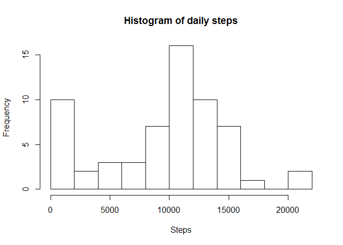
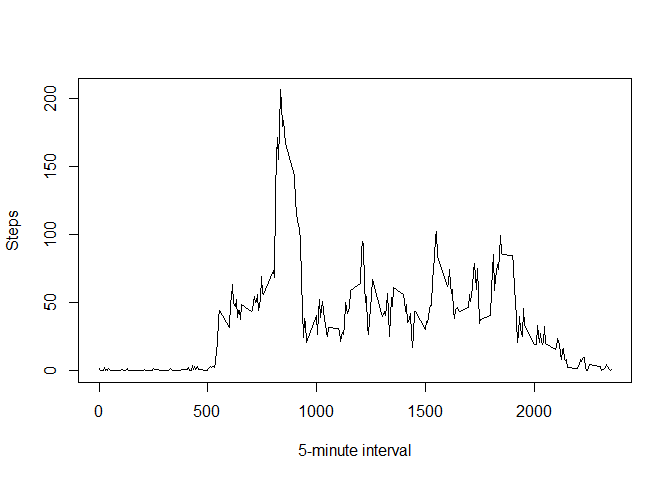
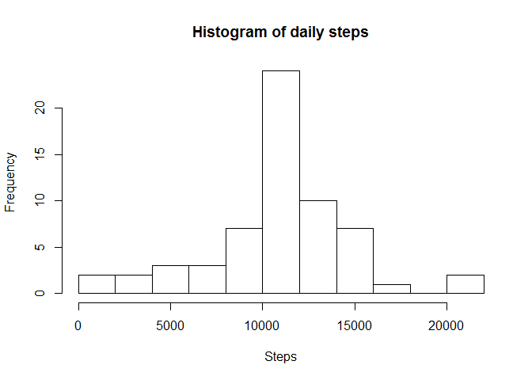
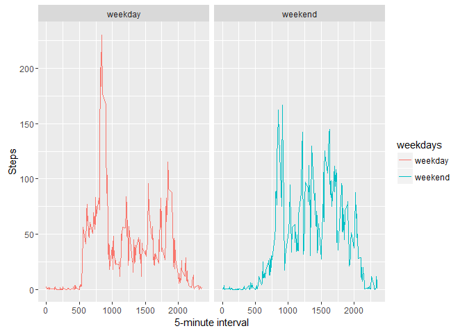

# Reproducible Research: Peer Assessment 1
# Assignment: Course project1

###Introduction

It is now possible to collect a large amount of data about personal movement using activity monitoring devices such as a Fitbit, Nike Fuelband, or Jawbone Up. These type of devices are part of the "quantified self" movement - a group of enthusiasts who take measurements about themselves regularly to improve their health, to find patterns in their behavior, or because they are tech geeks. But these data remain under-utilized both because the raw data are hard to obtain and there is a lack of statistical methods and software for processing and interpreting the data.

This assignment makes use of data from a personal activity monitoring device. This device collects data at 5 minute intervals through out the day. The data consists of two months of data from an anonymous individual collected during the months of October and November, 2012 and include the number of steps taken in 5 minute intervals each day.

The data for this assignment can be downloaded from the course web site:

Dataset: Activity monitoring data [52K]
The variables included in this dataset are:

steps: Number of steps taking in a 5-minute interval (missing values are coded as NA)
date: The date on which the measurement was taken in YYYY-MM-DD format
interval: Identifier for the 5-minute interval in which measurement was taken
The dataset is stored in a comma-separated-value (CSV) file and there are a total of 17,568 observations in this dataset.

## Library loading


```r
library(dplyr)
```

```
## 
## Attaching package: 'dplyr'
```

```
## The following objects are masked from 'package:stats':
## 
##     filter, lag
```

```
## The following objects are masked from 'package:base':
## 
##     intersect, setdiff, setequal, union
```

```r
library(ggplot2)
```


## Loading and preprocessing the data


```r
dat <- read.csv(file="./activity.csv", header=T, sep=",")
dat$date <- as.Date(dat$date)
```


## What is mean total number of steps taken per day?


```r
daily_sum <- dat %>% group_by(date) %>% summarise(total=sum(steps, na.rm=T))
hist(daily_sum$total, breaks=10, xlab="Steps", main="Histogram of daily steps")
```



```r
daily_mean <- dat %>% group_by(date) %>% summarise(total=sum(steps, na.rm=T)) %>% ungroup %>% summarise(mean=mean(total, na.rm=T))
daily_mean
```

```
## Source: local data frame [1 x 1]
## 
##      mean
##     (dbl)
## 1 9354.23
```

```r
daily_median <- dat %>% group_by(date) %>% summarise(total=sum(steps, na.rm=T)) %>% ungroup %>% summarise(medain=median(total, na.rm=T))
daily_median
```

```
## Source: local data frame [1 x 1]
## 
##   medain
##    (int)
## 1  10395
```


## What is the average daily activity pattern?


```r
dat_by_interval<- dat %>% group_by(interval) %>% summarise(mean=mean(steps, na.rm=T))

with(dat_by_interval,plot(x=interval, y=mean, type="l", ylab="Steps", xlab="5-minute interval"))
```



```r
dat_by_interval[which.max(dat_by_interval$mean),]
```

```
## Source: local data frame [1 x 2]
## 
##   interval     mean
##      (int)    (dbl)
## 1      835 206.1698
```


## Imputing missing values

the missing values are replaced by mean values from the same intervals

```r
table(is.na(dat$steps))
```

```
## 
## FALSE  TRUE 
## 15264  2304
```

```r
for(i in 1:nrow(dat)) {
    if(is.na(dat$steps[i])) {
        temp <- subset(dat_by_interval,dat_by_interval$interval==dat$interval[i])
        dat$steps[i] <- temp$mean
    }
}

daily_sum <- dat %>% group_by(date) %>% summarise(total=sum(steps, na.rm=T))
hist(daily_sum$total, breaks=10, xlab="Steps", main="Histogram of daily steps")
```




## Are there differences in activity patterns between weekdays and weekends?


```r
dat$weekdays <- ifelse((weekdays(dat$date) %in% c("Sunday","Saturday")), "weekend", "weekday")

dat_by_interval<- dat %>% group_by(weekdays,interval) %>% summarise(mean=mean(steps, na.rm=T))

ggplot(dat_by_interval, aes(x=interval, y=mean)) + geom_line(aes(col=weekdays)) + facet_grid(.~ weekdays) + xlab("5-minute interval") + ylab("Steps")
```



